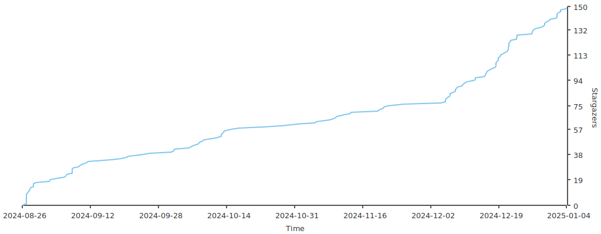

serv00和ct8主机一键安装哪吒探针和多主机保活
======================================================

## 1 背景
基于`serv00`和`ct8`这种配置较低的主机，比较适合用来做探针。目前还没发现能自动安装哪吒面板和agent客户端的脚本，以及多主机间动态保活，所以写了这个项目。

哪吒v0版本的效果体验：[https://monitor1.typecodes.us.kg](https://monitor1.typecodes.us.kg) 。

哪吒v1版本的效果体验：[https://monitor2.typecodes.us.kg](https://monitor2.typecodes.us.kg) 。


## 2 特点

```
1、支持分别安装最新v1或者v0版本的哪吒探针dashboard和agent客户端，且安装时基本一路点确认即可，无需复杂操作；
2、弃用PM2，使用脚本进行进程监控，尽量避免被serv00或者ct8杀掉；
3、自动生成crontab，实现进程监控和主机保活；
4、对于多个主机，可以实现相互保活；
5、多个主机之间的通信，使用ssh公私钥，无需暴露主机密码；
6、对于单serv00主机，支持通过 青龙面板 或者其它云主机对单个serv00或者ct8主机进行进程监控和保活；
7、支持自定义进程保活，例如自己写的任何一个服务，可以在monitor.conf配置文件中简单配置即可；
8、支持企业微信机器人、企业微信app应用、tg、pushPlus等监控通知；
9、支持七牛、腾讯云cos、阿里云oss云存储备份哪吒面板数据库。
```


## 2 使用步骤

```
1、下载脚本: git clone https://github.com/vfhky/serv00_ct8_nezha.git
2、进入项目: cd serv00_ct8_nezha
3、修改配置（非必须的操作）: vim config/host.eg
4、开始安装: python3 main.py 。
```


## 3 配置文件说明

在`config`配置目录下面有4个模板文件，其中`host.eg`和`sys.eg`这两个配置文件是需要`【手工配置】`，其它两个文件都不需要修改（系统会自动根据相关逻辑生成对应的`xxx.conf`配置文件）。

#### 3.1 主机配置模板 host.eg

`host.eg`用于填写需要相互保活的主机信息：如果你只有一台serv00/ct8机器，那么就不需要修改。

当你有多台serv00/ct8，那么通过这个配置实现多主机相互保活。例如用当前serv00/ct8主机和另外一个s9的serv00机器(用户名是vhub)做相互保活，那么在文件中追加如下配置即可：

```
s9.serv00.com|22|vhub|password
```

#### 3.2 系统常量模板 sys.eg

这个是系统配置文件，通过修改相关菜单可以开启企业微信机器人、企业微信app应用、tg、pushPlus、七牛云备份等功能。

#### 3.3 进程监控模板 monitor.eg

用于进程监控：当进程（如dashboard面板）不存在时（可能被serv00系统自动杀掉），会自动重新拉起该进程。

当安装完哪吒dashboard和agent后，系统会自动生成类似以下的配置。当然也可以手工追加任意你写的进程来实现该进程的监控保活。

```
/home/vfhky/nezha_app/agent|nezha-agent|sh nezha-agent.sh|foreground
/home/vfhky/nezha_app/dashboard|nezha-dashboard|./nezha-dashboard|background
```

#### 3.4 多主机心跳保活模板 heartbeat.eg

当在`host.eg`配置文件中新增了要相互保活的主机，系统会自动生成多主机间保活相互保活的配置数据（示例如下）：

`s9.serv00.com|22|vhub`


## 4 相关手册

以下是`安装哪吒探针`、`探针进程监控保活`、`多主机保活原理`、`面板sqlite.db备份`等功能的文档，方便大家参考查阅：

1、常规手工安装哪吒探针V0版本： 包括如何server00开启应用、TCP端口、申请github的token等等，[《在serv00主机上安装哪吒探针》](https://typecodes.com/linux/server00installnezha.html)

2、一键安装哪吒探针V0版本： [《serv00和ct8主机一键安装哪吒探针和多主机保活》](https://typecodes.com/python/serv00ct8nezha.html)

3、架构说明（含保活原理等）： [《serv00和ct8主机一键安装哪吒探针和多主机保活(二)》](https://typecodes.com/python/serv00ct8nezha2.html)

4、使用青龙面板对单台serv00保活： [《serv00和ct8主机一键安装哪吒探针和多主机保活(三)》](https://typecodes.com/python/serv00ct8nezha3.html)

5、utils.sh 强大的serv00脚本工具： [《serv00和ct8主机一键安装哪吒探针和多主机保活(四)》](https://typecodes.com/python/serv00ct8nezha4.html)

6、使用七牛、腾讯云cos、阿里云oss云存储备份哪吒面板数据库： [《serv00和ct8主机一键安装哪吒探针和多主机保活(五)》](https://typecodes.com/python/serv00ct8nezha5.html)

7、修复项目中哪吒面板不显示主机区域的问题： [《serv00和ct8主机一键安装哪吒探针和多主机保活(六)》](https://typecodes.com/python/serv00ct8nezha6.html)

8、一键安装哪吒探针V1版本： [serv00和ct8主机一键安装哪吒探针V1版本和多主机保活](https://typecodes.com/python/serv00ct8nezhav1.html)

9、升级哪吒探针V1版本开通Github、Gitee的OAuth2登录： [serv00和ct8上的哪吒探针V1开启Github和Gitee登录](https://typecodes.com/python/serv00ct8nezhav1githubgiteelogin.html)

## 5 Stars 趋势

<a href="https://github.com/vfhky/serv00_ct8_nezha/stargazers" target="_blank"></a>